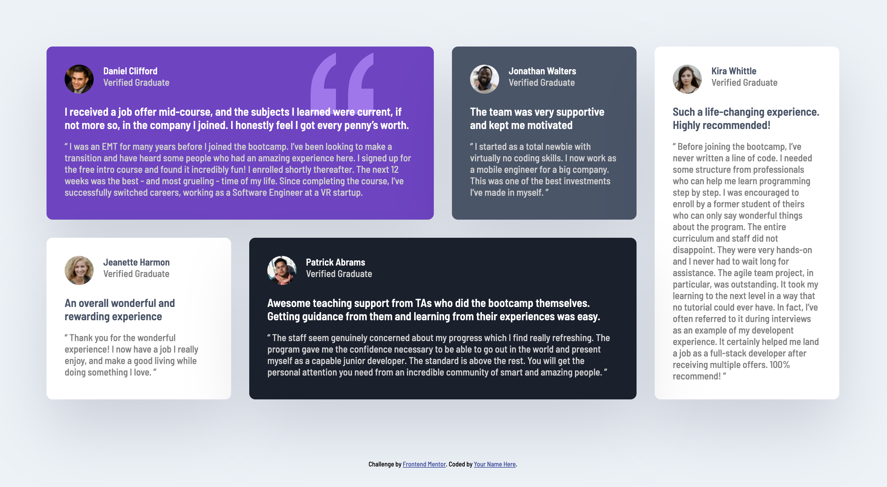

# Frontend Mentor - Testimonials grid section solution

This is a solution to the [Testimonials grid section challenge on Frontend Mentor](https://www.frontendmentor.io/challenges/testimonials-grid-section-Nnw6J7Un7). Frontend Mentor challenges help you improve your coding skills by building realistic projects.

## Table of contents

- [Overview](#overview)
  - [The challenge](#the-challenge)
  - [Screenshot](#screenshot)
  - [Links](#links)
- [My process](#my-process)
  - [Built with](#built-with)
  - [What I learned](#what-i-learned)
  - [Continued development](#continued-development)
- [Author](#author)

## Overview

## The challenge

Users should be able to:

- View the optimal layout for the site depending on their device's screen size

### Screenshot



### Links

- Solution URL: [Add solution URL here](https://github.com/apah-dev/testimonials-grid-section-main.git)
- Live Site URL: [Add live site URL here](https://apah-dev.github.io/testimonials-grid-section-main/)

## My process

### Built with

- Semantic HTML5 markup
- CSS custom properties
- Grid
- Flexbox
- Media Query

### What I learned

Learnt how to use grid to create layouts
Learnt how to span grid columns and rows to fit the layout of the design
Learnt how to use the background-image position and background-repeat

```css
background-color: var(--violet);
background-image: url("./images/bg-pattern-quotation.svg");
background-repeat: no-repeat;
background-position: top 10px right 100px;
```

### Continued development

I intend to understand how to deal with spaces in the body of my page when i want to eliminate such spaces for mobile view to prevent scrolling

## Author

- Frontend Mentor - [@apah-dev](https://www.frontendmentor.io/profile/apah-dev)
- Twitter - [@benson_apah](https://www.twitter.com/benson_apah)
